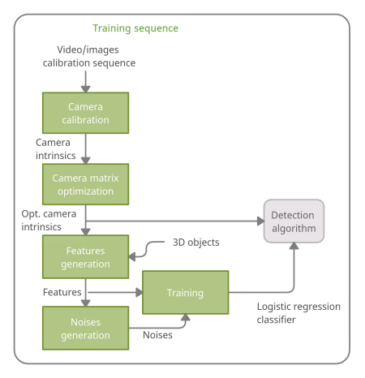
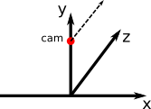

# Training a classification model for the [lightweight detection algorithm](https://github.com/necator9/detection_method)  
The following steps describe the process of synthetic features and noises generation, and training a logistic regression classifier.
Implementation of the method is based on the publication [“Fast Object Detection Using Dimensional Based Features for Public Street Environments”](https://www.mdpi.com/2624-6511/3/1/6).



## 1. [Camera calibration](https://github.com/necator9/video2calibration)
## 2. [Camera matrix optimization](https://github.com/necator9/get_optimal_cam_mtx)
## 3. Generate synthetic features using 3D models of objects 
Synthetic scenes containing 3D objects are rendered in the 2D image. 
Parameters of objects (size, rotation, coordinates) and camera (incline, intrinsics) are set in the config file.
These parameters are chosen according to expected usage scenario.
It is recommended to perform the following steps on multi-core servers, otherwise the process can take significant time.


### 3.1 Install requirements
```text
pip3 install -r requirements.txt
```

### 3.2 Adjust config file

Parameters of a scene to be generated are specified in yaml file (see examples `scenes/all_scenes.yml` and `scenes/lamp_pole.yml`).
#### Section `camera`

Parameters to set camera intrinsics and camera angle  

| key | description |
|---|---|
| params | path to optimized camera parameters which have been obtained on step 2 (mentioned above ), see `camera_matrices/` for examples|
| angle  |  camera incline towards to ground surface: 0 deg. - the camera is parallel to the ground surface; -90 deg. - camera points perpendicularly down |

#### Section `obj_global`
| key | description |
|---|---|
| thr | size of a kernel for morphological dilate on the resulting mask to imitate motion blur |
| x_range | object coordinates in meters along x axis (left, right relatively camera)  |
| y_range  | ground surface coordinates in meters relatively to a camera origin (e.g. -5 is 5m of camera height)  |
| z_range | distance to an object from camera in meters |



#### Section `obj:object_name`

| key | description |
|---|---|
| file | path to object wavefront `.obj` file containing vertices and polygons of the objects |
| scale | scaling the object along y axis (the desired height  of the object in meters), the scaling is uniform |
| rotate_y | range of object rotation angles about y axis (movement direction imitation) |
| ry_init| initial offset of r_y (some objects are initially rotated by back to a camera) | 
| class | integer object class used for training and classification |

### 3.3 Adjust camera parameters

Camera parameters are set using the key `params` of the main config described above.

- Generate base file containing camera parameters via [camera matrix optimization](https://github.com/necator9/get_optimal_cam_mtx) 
  which requires preliminary [camera calibration](https://github.com/necator9/get_optimal_cam_mtx)
- **Manually add field** `focal_length` to the  base file with camera parameters. 
  The `focal_length` is measured in mm and can be found in camera documentation.
### 3.4 Generate features 

```text
usage: feat_gen.py [-h] [--csv CSV] [--show] config

Generate features of 3D objects

positional arguments:
  config      path to the configuration file

optional arguments:
  -h, --help  show this help message and exit
  --csv CSV   path to the output csv file (default:features.csv)
  --show      show the generated images (for debug only)
```

For example:

```text
./feat_gen.py /path/to/adjusted_config.yml
```

The output of this script is a `csv` file containing object features for classifier training.

Names of columns used in the output `csv` can be changed in `map.py` which has the following mapping by default:

| column | description |
|---|---|
| cam_a | camera incline relative to a ground surface, deg |
| y | ground surface offset (negative camera height) relative to a camera origin, m |
| z_est | distance to the closest object point (for a camera) estimated by feature extractor, m |
| z | real object distance the closest object point (for a camera), m |
| x_est | central object x coordinate estimated by feature extractor, m |
| x | real central object x coordinate, m |
| width_est | object width estimated by feature extractor, m |
| ww | real object width, m |
| height_est | object height estimated by feature extractor, m |
| hh | real object height, m | 
| rw_ca_est | object contour area estimated by feature extractor, m2 |
| o_name | unique name of an object |
| o_class | object class as an integer, where 0 is a noise class |
| ry | initial offset of r_y (some objects are initially rotated by back to a camera) |
| x_px | left upper x coordinate of an object bounding rectangle in image plane, px |
| y_px | left upper y coordinate of an object bounding rectangle in image plane, px |
| w_px| width of an object bounding rectangle in image plane, px |
| h_px | height of an object bounding rectangle in image plane, px |
| c_ar_px | object contour area in image plane, px |
| thr | size of the used kernel for morphological dilate on the resulting mask to imitate motion blur| 
| dd | real object depth, m |

Note that only a few generated features are used for classifier training, the rest is useful for debugging on the stage of features evaluation.
## 4. Generate noises
Pass the path to generated features (step 3.3) as CL argument and run the script to generate noises.

```text
usage: noise_gen.py [-h] [-n NOISES] [-p POINTS] features

Generate noises around features

positional arguments:
  features              path to the features csv file

optional arguments:
  -h, --help            show this help message and exit
  -n NOISES, --noises NOISES
                        path to the output csv file containing noises features (default:noises.csv )
  -p POINTS, --points POINTS
                        amount of points per hull (default: 40000)
```

For example:

```text
./noise_gen.py /path/to/object_features.csv
```
The output of this script is a `csv` file containing noises features for classifier training.

## 5. Evaluate feature distribution
Use the `eval_notebooks/show_features.ipynb` (jupyter-notebook) to plot the generated features. 
Make sure that features for all the required classes are represented in plots. 

### 5.1 Troubleshooting
If some classes are not shown in plots `eval_notebooks/show_features.ipynb` it is possible to visualize how the images are rendered:
- limit amount of generated scenes by narrowing the config (e.g. `scenes/test_3`)
- add `--show` option when running script for feature generation:
  ```text
  ./feat_gen.py scenes/test_3.yml --show
  ```


## 6. Train the logistic regression classifier
Pass the path to generated features and noises as CL arguments and run the script.

```text
usage: train_separate_models.py [-h] [-c CLF] features noises

Train the logistic regression classifier

positional arguments:
  features           path to the features csv file
  noises             path to the noises csv file

optional arguments:
  -h, --help         show this help message and exit
  -c CLF, --clf CLF  path to the output classifier (default: clf.pcl)
```

For example:

```text
./train_separate_models.py /path/to/object_features.csv /path/to/noises_features.csv
```

The output of the script is a pickled python dictionary with [sklearn.preprocessing.PolynomialFeatures](https://scikit-learn.org/stable/modules/generated/sklearn.preprocessing.PolynomialFeatures.html) and [sklearn.linear_model.LogisticRegression](https://scikit-learn.org/stable/modules/generated/sklearn.linear_model.LogisticRegression.html)  of the following structure:

```text
{'poly': object sklearn.preprocessing.PolynomialFeatures
 cam_height_1:
     {cam_angle_1: object sklearn.linear_model.LogisticRegression},
     {cam_angle_n: ...},
     {...}
 cam_height_n:
     {...},
     {...}
}
```

For example:
```python
{'poly': PolynomialFeatures(),
 -3.32: {-39.0: LogisticRegression(C=3, n_jobs=-1, solver='newton-cg', verbose=1)}, 
 -3.4: {-39.0: LogisticRegression(C=3, n_jobs=-1, solver='newton-cg', verbose=1)}
 }
```

The detection algorithm extracts `'poly'` and required classifier model depending on concrete usage scenario (set in config file of the detection algorithm).

# Cite

I. Matveev, K. Karpov, I. Chmielewski, E. Siemens, and A. Yurchenko, “Fast Object Detection Using Dimensional Based Features for Public Street Environments,” Smart Cities, vol. 3, no. 1, Art. no. 1, Mar. 2020, doi: 10.3390/smartcities3010006.
